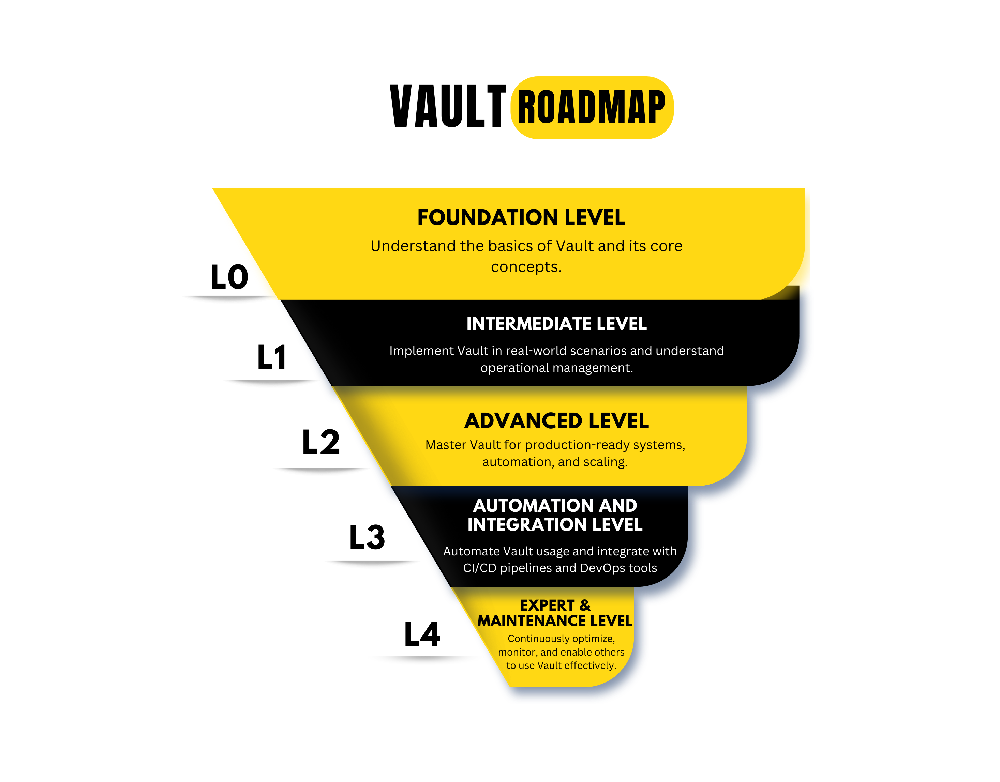

# 🔒[Vault](https://www.hashicorp.com/products/vault) Technical Enablement (VTE)
This repo provides resources for learning and demonstrating HashiCorp Vault, including demos, labs, deployment guides, and reference architectures. It supports technical teams in adopting Vault for secrets management, encryption, and access control across on-premise, cloud, and Kubernetes environments.

 [L0 - Foundation Level](roadmap/L0-foundation.md)   Understand the basics of Vault and its core concepts.
 [L1 - Intermediate Level](roadmap/L1-intermediate.md) 
      Implement Vault in real-world scenarios and understand operational management.
 [L2- Advanced Level](roadmap/L2-advanced.md)
      Master Vault for production-ready systems, automation, and scaling.
  [L3- Automation & Integration Level](roadmap/L3-automation.md)
     Automate Vault usage and integrate with CI/CD pipelines and DevOps tools.
 [L4- Expert & Maintenance Level](roadmap/L4-expert.md)
     Continuously optimize, monitor, and enable others to use Vault effectively.
  ⚙️ [Deploy Vault using GitOps](https://github.com/cloud-native-toolkit/multi-tenancy-gitops/blob/master/doc/ibm-vault-recipe.md)
      Assuming you got an OpenShift cluster ready with GitOps operator installed, follow the recipe step-by-step to be able to deploy Vault.
  🚀 [Vault Associate Exam Prepration](https://github.com/therayy/Vault-Associate)
      A 100 Q & A's specially made for you to help you pass and earn the Vault Associate Certification exam.

## Thank You!

> 👤 Raafat Abaid (Ray)  
> Email: Raafat@ibm.com  
> Slack: @Ray

